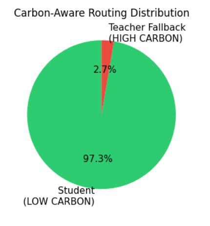
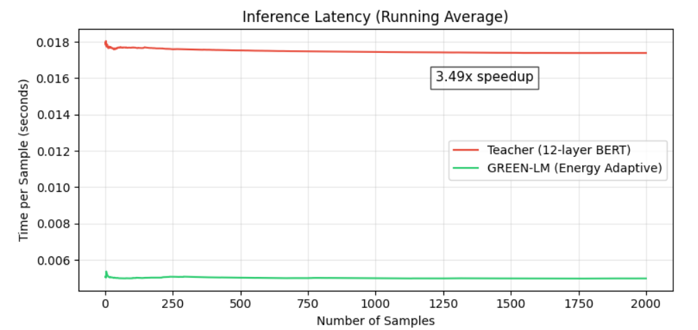

# 🌱 GREEN-LM
**Carbon-Aware, Energy-Adaptive Language Model**

> Can a language model be accurate *and* know when to stop thinking?

GREEN-LM is an efficient text-classification system that pairs a 12-layer BERT **teacher** with a distilled 6-layer BERT **student**, using early-exit inference and carbon-aware routing so most inputs never need the full model.

---

## The Idea

Not every input deserves the same amount of compute. An easy, obvious example shouldn't cost as much as an ambiguous one — so GREEN-LM lets each input decide for itself how deep it needs to go.

```
INPUT → Student (6 layers) → confident? → EXIT EARLY
                            → unsure?    → Teacher (12 layers) → PREDICTION
```

Most efficiency work in NLP treats the model as the thing to shrink: prune it, quantize it, distill it once, ship the smaller version everywhere. That saves compute uniformly, whether an input needed it or not. GREEN-LM instead treats *each inference* as its own decision — a clearly-worded, unambiguous article barely needs three layers to classify, while a subtle or adversarial one might need all twelve. Averaging those two cases into one fixed-depth model wastes computation on the easy case to stay safe enough for the hard one.

The routing decision is also informed by the simulated grid carbon signal. When intensity is low, the system can afford to be more conservative and lean on the teacher for borderline cases. When intensity is high, it tightens the confidence threshold and pushes harder toward the cheaper student path — accuracy and energy cost become dials tuned against each other, rather than a trade-off fixed once at training time.

## Results

Evaluated on 2,000 fake-news classification samples:

| Metric | Value |
|---|---:|
| Accuracy | **99.90%** |
| Handled by student model | **97.3%** |
| Escalated to teacher | **2.7%** |
| Precision / Recall / F1 (both classes) | **1.00** |

**Where inputs exited:**

| Exit point | Samples |
|---|---:|
| Student — Layer 3 | 1,901 |
| Student — Layer 4 | 43 |
| Student — Layer 6 | 2 |
| Teacher — full 12 layers | 54 |

95% of samples were confidently resolved just **3 layers deep** — a strong signal that most inputs don't need the full network at all.

<p align="center">
  
  &nbsp;&nbsp;
  
</p>

The routing plays out almost entirely under low-carbon conditions, where the student model handles the load — and that lighter path translates directly into speed: GREEN-LM's adaptive pipeline runs **3.49x faster** than the full 12-layer teacher, with latency staying flat as sample count scales.

**Classification performance, by class:**

| Class | Precision | Recall | F1 |
|---|---:|---:|---:|
| FAKE | 1.00 | 1.00 | 1.00 |
| REAL | 1.00 | 1.00 | 1.00 |

Routing most inputs to a six-layer model didn't cost anything measurable in precision or recall — the confidence threshold governing early exit was tuned so that only genuinely well-separated predictions leave the student path early.

## Dataset

Binary classification of news articles into **FAKE** and **REAL**, using the [Fake and Real News Dataset](https://www.kaggle.com/datasets/clmentbisaillon/fake-and-real-news-dataset) on Kaggle.

**Setup:** after downloading, place the files as follows:

```
GREEN_LM/
└── datasets/
    ├── Fake.csv
    └── True.csv
```

The final evaluation set draws 2,000 samples from these files. The dataset is used for research and educational purposes in the GREEN-LM project.

> **Note:** `Fake.csv` and `True.csv` are excluded from this GitHub repository due to their file size. Download them directly from the Kaggle link above and place both files under `datasets/` before running the notebook.

## How It Works

1. **Teacher model** — a 12-layer BERT fine-tuned for FAKE/REAL classification, providing the ground-truth behavior to learn from.
2. **Student model** — a 6-layer BERT initialized from the teacher, trained to be a cheaper stand-in.
3. **Knowledge distillation** — sparse distillation + ground-truth supervision transfers the teacher's judgment into the smaller student.
4. **Early-exit inference** — intermediate classification heads let the student stop as soon as it's confident, skipping unnecessary layers.
5. **Carbon-aware routing** — routing aggressiveness adapts to grid carbon intensity, currently simulated via predefined time-based values rather than a live carbon API.

## Tech Stack

Python · PyTorch · Transformers & Datasets · Scikit-learn · Pandas · NumPy · Matplotlib

## Project Structure

```
GREEN_LM/
├── .gitignore
├── README.md
├── green_lm.ipynb
├── requirements.txt
└── results/
    ├── result1.png
    └── result2.png
```

## Getting Started

```bash
git clone <YOUR-GITHUB-REPOSITORY-URL>
cd GREEN-LM
pip install -r requirements.txt
```

Then open `green_lm.ipynb` in Jupyter, VS Code, or Colab and run through the pipeline: **dataset → tokenization → teacher training → student init → distillation → early-exit training → carbon-aware routing → evaluation.**

## Why It Matters

The goal isn't just a smaller model — it's an *adaptive* one. Easy inputs exit fast; hard inputs still get the full teacher's attention. That trade-off, held in balance, is where efficiency actually comes from.

## Limitations & What's Next

- **Simulated carbon signal** — grid intensity currently comes from predefined time-based values, not a live feed like WattTime or ElectricityMap. Swapping in a real API is the most direct next step toward matching the published methodology.
- **Single-domain evaluation** — results are reported on one binary fake-news task. Generalizing the routing thresholds to multi-class or regression settings hasn't been tested yet.


## Note on Scope

This is an implementation inspired by the published GREEN-LM methodology, not a strict reproduction. Carbon intensity is currently simulated with time-based values rather than pulled from a live grid API, so results may differ from the original paper.

## Reference

*GREEN-LM: Carbon-aware neural language models with energy-adaptive layers and sparse knowledge distillation*
Results in Engineering, 2026 · [DOI: 10.1016/j.rineng.2026.112223](https://doi.org/10.1016/j.rineng.2026.112223)

---
Built exploring: Knowledge Distillation · Efficient AI · Early-Exit Networks · Carbon-Aware Computing
